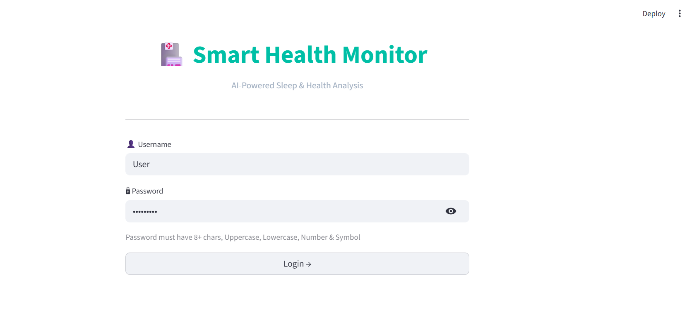
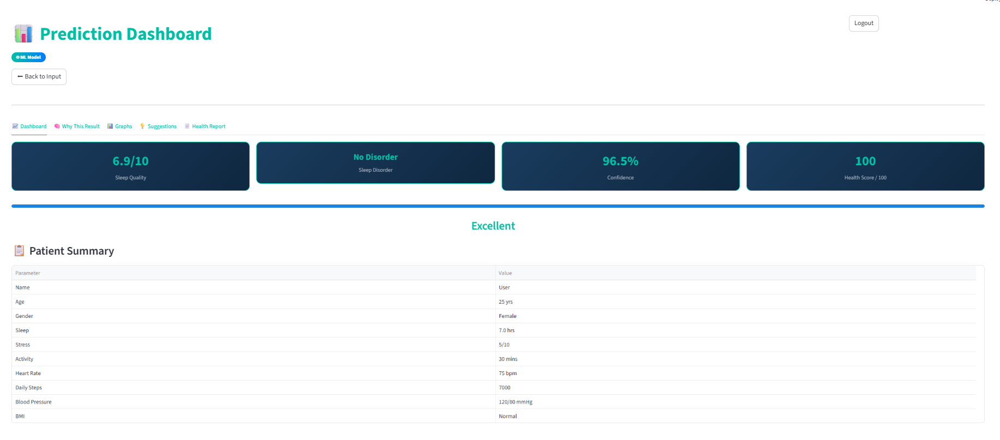
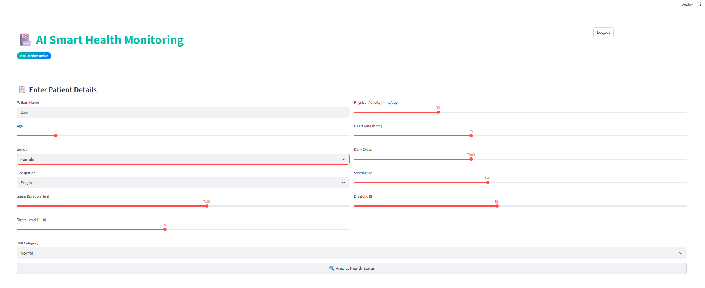
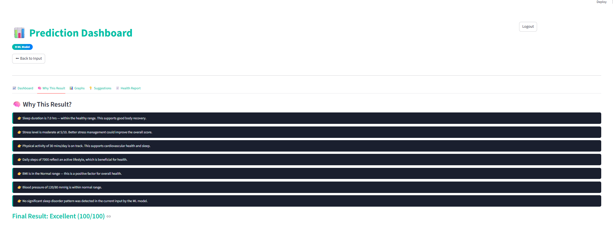
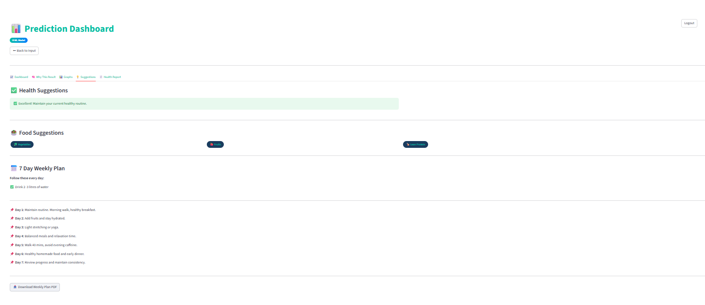
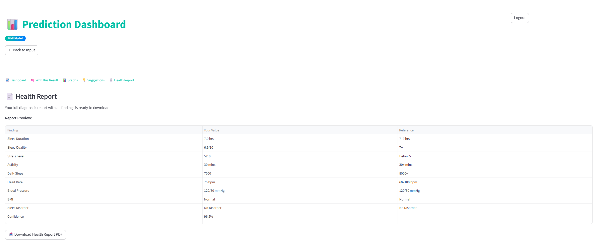

# 🏥 Smart Health Monitoring and Sleep Analysis System

<p align="center">
  <b>An AI-powered health monitoring application that predicts sleep quality and sleep disorders using Machine Learning.</b>
</p>

---

## 📌 About the Project

The **Smart Health Monitoring and Sleep Analysis System** is a Machine Learning-based web application developed using **Python** and **Streamlit**.

The application analyzes a user's health and lifestyle information to predict:

- 😴 Sleep Quality
- 🩺 Sleep Disorder

It also provides personalized health suggestions, visual dashboards, weekly health plans, and downloadable health reports to help users improve their lifestyle.

---

## ✨ Features

- 🔐 User Login
- 📝 Health Information Form
- 🤖 Machine Learning Predictions
- 😴 Sleep Quality Prediction
- 🩺 Sleep Disorder Detection
- 📊 Health Dashboard
- 📈 Data Visualizations
- 💡 Personalized Health Suggestions
- 🥗 Food Recommendations
- 📅 Weekly Health Plan
- 📄 PDF Health Report Generation

---

## 🛠️ Tech Stack

| Category         | Technologies     |
| ---------------- | ---------------- |
| Programming      | Python           |
| Web Framework    | Streamlit        |
| Machine Learning | Scikit-learn     |
| Data Processing  | Pandas, NumPy    |
| Visualization    | Matplotlib       |
| Model Storage    | Joblib           |
| Development      | Jupyter Notebook |

---

## 🤖 Machine Learning Models

### Regression Model

- Predicts Sleep Quality Score

### Classification Model

- Predicts Sleep Disorders:
  - No Disorder
  - Insomnia
  - Sleep Apnea

---

## 📊 Dataset

**Sleep Health and Lifestyle Dataset**

The dataset includes the following information:

- Gender
- Age
- Occupation
- Sleep Duration
- Quality of Sleep
- Physical Activity Level
- Stress Level
- BMI Category
- Heart Rate
- Daily Steps
- Blood Pressure
- Sleep Disorder

---

## 📁 Project Structure

```text
Smart-health-monitoring-and-Sleep-analysis-system/
│
├── app.py
├── main.ipynb
├── requirements.txt
├── README.md
├── Sleep_health_and_lifestyle_dataset.csv
│
├── models/
│   ├── sleep_quality_model.pkl
│   ├── sleep_disorder_model.pkl
│   ├── scaler_regression.pkl
│   ├── scaler_classification.pkl
│   ├── regression_columns.pkl
│   └── classification_columns.pkl
│
└── reports/
    ├── comparison_classification.png
    ├── comparison_regression.png
    ├── feature_importance_classification.png
    ├── feature_importance_regression.png
    └── EDA Visualizations
```

---

## 🚀 Installation

Clone the repository

```bash
git clone https://github.com/iamprithuhs/Smart-health-monitoring-and-Sleep-analysis-system.git
```

Move into the project directory

```bash
cd Smart-health-monitoring-and-Sleep-analysis-system
```

Install dependencies

```bash
pip install -r requirements.txt
```

Run the application

```bash
streamlit run app.py
```

---

## 🔄 Project Workflow

1. User enters health and lifestyle information.
2. Data is preprocessed.
3. Machine Learning models analyze the data.
4. Sleep Quality is predicted.
5. Sleep Disorder is classified.
6. Health dashboard displays the results.
7. Personalized recommendations are generated.
8. Health report can be downloaded.

---

## 📊 Data Visualizations

The project includes:

- Sleep Disorder Distribution
- Sleep Duration Distribution
- Correlation Heatmap
- Stress vs Sleep Quality
- Physical Activity vs Sleep Quality
- Age vs Sleep Quality
- Feature Importance Analysis
- Model Comparison Graphs

---

## 📸 Application Screenshots

> Add screenshots of your application inside a folder named **screenshots**.

Example:

```text
screenshots/
├── login.png
├── input.png
├── dashboard.png
├── prediction.png
```

Then display them like this:

```markdown
### Login Page



### Prediction Result


### Dashboard


```

---

---

## 📸 Application Screenshots

### 🔐 Login Page


---

### 📝 Patient Information Form



---

### 📊 Prediction Dashboard


---

### 💡 Why This Result?



---

### 🥗 Health Suggestions



---

### 📄 PDF Health Report



---

## 🎯 Future Enhancements

- Deep Learning Models
- Cloud Deployment
- Wearable Device Integration
- Doctor Recommendation System
- Mobile Application
- Real-time Health Monitoring

---

## 👨‍💻 Author

**Prithu H S**

Computer Science Engineer

- GitHub: https://github.com/prithu-hs

---

## ⭐ Support

If you found this project useful, consider giving it a ⭐ on GitHub.
